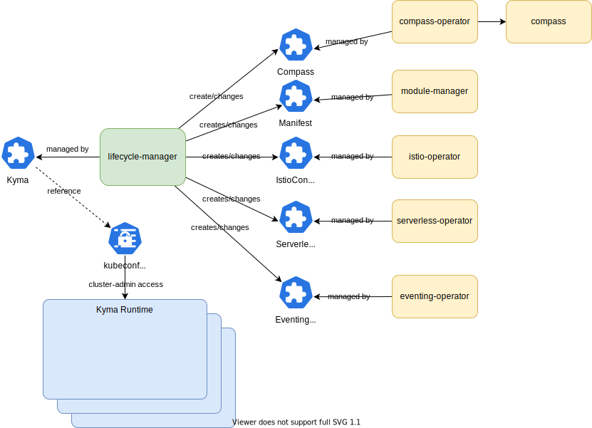

# Lifecycle Manager

Kyma is the opinionated set of Kubernetes based modular building blocks that includes the necessary capabilities to develop and run enterprise-grade cloud-native applications. Kyma's Lifecycle Manager (or `lifecycle-manager` in various technical references) is a tool that manages the lifecycle of these components in your cluster.

## How it works

Lifecycle Manager manages Clusters through the [Kyma Custom Resource](operator/api/v1alpha1/kyma_types.go), which contains a desired state of all modules in a cluster.

Based on the [ModuleTemplate Custom Resource](operator/api/v1alpha1/moduletemplate_types.go), it resolves a set of image layers from an OCI Registry and creates custom resources for the [Module Manager](https://github.com/kyma-project/module-manager/). This is the basic delivery model for all modules.
Using its created resources in the initial delivery of a module, it  then updates the [Kyma Custom Resource](operator/api/v1alpha1/kyma_types.go) based on the observed status changes in the Module Custom Resources (similar to a native kubernetes deployment tracking availability).

Module operators only have to watch their own custom resources and reconcile modules in the target clusters to the desired state. These states are then aggregated to reflect the cluster state. Please reference [Module Manager](https://github.com/kyma-project/module-manager/) in order to gain more insight into how each module is collecting its status and report it to the Lifecycle Manager.

### Example

A sample `Kyma` CR could look like this:
```
apiVersion: operator.kyma-project.io/v1alpha1
kind: Kyma
metadata:
  name: my-kyma
spec:
  modules:
  - name: istio
```

The creation of the custom resource triggers a reconciliation that creates a Manifest for `istio` based on a [ModuleTemplate](operator/api/v1alpha1/moduletemplate_types.go) found in the cluster.
When each module operator completes their installation, it reports it's own resource status (`.status.state`). Status changes trigger [Module Manager](https://github.com/kyma-project/module-manager/) to update the manifest of the module.
Lifecycle Manager then uses this to aggregate and combine the readiness condition of the cluster and determine the installation state or trigger more reconciliation steps.

## Architecture

The architecture of this operator is based on Kubernetes controllers/operators. `lifecycle-manager` is a meta operator that coordinates and tracks the lifecycle of kyma components by delegating it to module operators. You can compare it to [Operator Lifecycle Manager](https://olm.operatorframework.io/) from Operator Framework, and we are strongly inspired by their ideas. One of the main differentiating factors however, is that the Scope of the Kyma Lifecycle Manager is to reconcile not only locally, but also into remote Clusters.

A few selected key advantages include:

- Manage Operators completely free of dependency-trees and without opinionation on dependency resolution
- Reconcile many clusters (up to 10.000 per control-plane are measured with our performance tests) from a control-plane
- Centralize the effort on managed Runtimes by providing a Control-Plane style Reconciliation Mechanism
- Use familiar Release Concepts of Release Channels to manage delivery of operators

Before you go further, please make sure you understand concepts of Kubernetes API and resources. Recommended reading:
- [Kubebuilder book](https://book.kubebuilder.io/)
- [Operator SDK](https://sdk.operatorframework.io/docs/building-operators/golang/)

The architecture is based as much as possible on best practices for building Kubernetes operators ([1](https://cloud.google.com/blog/products/containers-kubernetes/best-practices-for-building-kubernetes-operators-and-stateful-apps), [2](https://sdk.operatorframework.io/docs/best-practices/)).

The diagram below shows a sample deployment of a Control-Plane in interaction with the Kyma Runtime. Please use this diagram not as a single source of truth (as diagrams like to be treated in README's), but rather a reference for navigation of nomenclature and terms, as real deliveries can differ significantly depending on the tradeoffs chosen for reconciliation.



### Stability

Some architecture decisions were derived from business requirements and experiments (proof of concepts) and are still
subject to change, however the general reconciliation model is considered ready for use already.

Here is a (somewhat complete) list of the different modules in the system together with their stability:

| System Component                                                | Stability                                                                                                     |
|-----------------------------------------------------------------|---------------------------------------------------------------------------------------------------------------|
| [Kyma](operator/api/v1alpha1/kyma_types.go)                     | Alpha-Grade - do not rely on in automation and watch upstream as close as possible                            |
| [ModuleTemplate](operator/api/v1alpha1/moduletemplate_types.go) | Alpha-Grade - only use together with Kyma CLI; expect regular breaking changes in the module bundling process |
| [Controller](operator/controllers/kyma_controller.go)           | In active development (continuous) - Expect Bugs and fast-paced development of new features                   |

## Deployment / Delivery models

lifecycle-manager (and module operators) can run in 2 modes:

- in-cluster - regular deployment in the kubernetes cluster where kyma should be deployed, control-plane manages itself
- control-plane - deployment on central kubernetes cluster that manages multiple kyma installations remotely (installing kyma on the remote clusters based on a secret providing connectivity details)

They both target different use cases. While in-cluster mode is useful for classical deployment of kyma with 1 cluster in play, the general consensus is that for large scale operations, it is recommended to either use an aggregated API-Server or use Clusters to manage other Clusters (nowadays known as Control-Plane)

This means that, depending on your environment you might be running lifecycle-manager in one or the other mode.

For local development, as well as for testing and verification purposes in integration testing, we recommend to use single-cluster mode. For E2E Testing,
and testing of scalability as well as remote reconciliation, we recommend the use of a separate control-plane cluster.

## Separate Release Lifecycles for Modules and their Managers (Modularization)

Teams providing module operators should work (and release) independently from lifecycle-manager. In other words, lifecycle-manager should not have hard-coded dependencies to any module operator. 
As such, all module interactions are abstracted through the [ModuleTemplate](operator/api/v1alpha1/moduletemplate_types.go).

This abstraction of a template is used for generically deploying instances of a module within a Kyma Runtime at a specific Release Group we call `Channel` (for more information, visit the respective Chapter in the [Concept for Modularization](https://github.com/kyma-project/community/tree/main/concepts/modularization#release-channels)). It contains not only a specification of a Module with it's different components through [OCM Component Descriptors](https://github.com/gardener/component-spec/blob/master/doc/proposal/02-component-descriptor.md).

These serve as small-scale BOM's for all contents included in a module and can be interpreted by Lifecycle Manager and [Module Manager](https://github.com/kyma-project/module-manager/)
to correctly install a module. (for more information, please have a look at the respective chapter in the [Kyma Modularization Concept](https://github.com/kyma-project/community/tree/main/concepts/modularization#component-descriptor))

### Versioning and Releasing

Kyma up to Version 2.x was always a single release. However, the vision of lifecycle-manager is to fully encapsulate individual Modules, with each providing a (possibly fully independent) Release Cycle.
However, Control-Plane deliveries are by design continuously shipped and improved. As a result, even if we will continue to support versioned Module Deliveries, the Lifecycle-Manager and its adjacent infrastructure will be maintained and delivered continously and it is recommended to track upstream as close as possible.

### Comparison to the Old Reconciler

Traditionally, Kyma was installed with the [Kyma Reconciler](https://github.com/kyma-incubator/reconciler), a Control-Plane implementation of our architecture based on polling and a SQL Store for tracking reconciliations.
While this worked great for smaller and medium scale deliveries, we had trouble to scale and maintain it when put under significant load.
We chose to replace this with Operator-focused Reconciliation due to various reasons, more details on the reasoning can be found in our [Concept for Operator Reconciliation](https://github.com/kyma-project/community/tree/main/concepts/operator-reconciliation)

