# Lifecycle Manager

Kyma is an opinionated set of Kubernetes based modular building blocks that includes the necessary capabilities to develop and run enterprise-grade cloud-native applications. Kyma's Lifecycle Manager is a tool that manages the lifecycle of these modules in your cluster.

### Contents
* [How it works](#how-it-works)
  * [Example](#example)
  * [Getting Started](#getting-started)
* [Architecture](#architecture)
  * [Stability](#stability)
* [Deployment / Delivery models](#deployment--delivery-models)
  * [Release Lifecycles for Modules](#release-lifecycles-for-modules)
  * [Versioning and Releasing](#versioning-and-releasing)
  * [Comparison to the Old Reconciler](#comparison-to-the-old-reconciler)
* [Testing and implementation guide](#testing-and-implementation-guide)

## Modularization

Lifecycle Manager manages Clusters through the [Kyma Custom Resource](api/v1beta1/kyma_types.go), which contains a desired state of all modules in a cluster. Imagine it as a one stop shop for a cluster where you can add and remove modules with domain-specific functionality with additional configuration.

The modules themselves are bundled containers based on the [OCI Image Format Specification](https://github.com/opencontainers/image-spec). 
They contain an immutable layer set of a module operator deployment description and its configuration. 



If you use Kyma's [CLI](https://github.com/kyma-project/cli), please refer to the `kyma alpha create module --help` section to learn more about it's structure and how it is created. You might even be able to use its inbuilt auto-detection of [kubebuilder](https://kubebuilder.io) projects to easily bundle your module with little effort.

The modules are installed and controlled by Lifecycle Manager. We use [Open Component Model](https://ocm.software) to describe all of our modules descriptively. 
Based on the [ModuleTemplate Custom Resource](api/v1beta1/moduletemplate_types.go), the module is resolved from its individual layers and version and is used as a template for the [Manifest](api/v1beta1/manifest_types.go). 
Whenever a module is accepted by Lifecycle Manager the ModuleTemplate gets translated into a Manifest, which describes the actual desired state of the module operator.

The Lifecycle Manager then updates the [Kyma Custom Resource](api/v1alpha1/kyma_types.go) of the cluster based on the observed status changes in the Module Custom Resources (similar to a native kubernetes deployment tracking availability).

Module operators only have to watch their own custom resources and reconcile modules in the target clusters to the desired state. 

### Example

A sample `Kyma` CR could look like this:
```
apiVersion: operator.kyma-project.io/v1beta1
kind: Kyma
metadata:
  name: my-kyma
spec:
  modules:
  - name: my-module
```

The creation of the custom resource triggers a reconciliation that
1. looks for a ModuleTemplate based on search criteria, for example the OCM Component Name of the Module or simply the of the `ModuleTemplate`
2. creates a `Manifest` for `my-module` based on a [ModuleTemplate](api/v1beta1/moduletemplate_types.go) found in the cluster by resolving all relevant image layer for the installation
3. installing the contents of the modules operator by applying them to the cluster, and observing its state
4. reporting back all states observed in the `Manifest` which then gets propagated to the `Kyma` resource for the cluster.
   Lifecycle Manager then uses this to aggregate and combine the readiness condition of the cluster and determine the installation state or trigger more reconciliation loops as needed.

As mentioned above, when each module operator completes their installation, it reports its own resource status. However, to accurately report state, we read out the `.status.state` field to accumulate status reporting for an entire cluster.

### Getting Started

If you are new to our Lifecycle Manager and want to get started quickly, we recommend that you follow our [Quick Start Guide](./docs/user/quick-start.md). This guide will walk you through the basic steps of setting up your local KCP cluster to installing the Lifecycle Manager, and using the main features.

## Deployment / Delivery models

lifecycle-manager (and module operators) can run in 2 modes:

- in-cluster - regular deployment in the kubernetes cluster where kyma should be deployed, control-plane manages itself
- control-plane - deployment on central kubernetes cluster that manages multiple kyma installations remotely (installing kyma on the remote clusters based on a secret providing connectivity details)

Which mode is used is based on the `.spec.target` attribute in the `ModuleTemplate`, determining wether a Module needs to be installed in the remote cluster or not.

They both target different use cases. While in-cluster mode is useful for classical deployment of kyma with 1 cluster in play, the general consensus is that for large scale operations, it is recommended to either use an aggregated API-Server or use Clusters to manage other Clusters (nowadays known as Control-Plane)

This means that, depending on your environment you might be running lifecycle-manager in one or the other mode.

For local development, as well as for testing and verification purposes in integration testing, we recommend to use single-cluster mode. For E2E Testing,
and testing of scalability as well as remote reconciliation, we recommend the use of a separate control-plane cluster.

### Release Lifecycles for Modules 

Teams providing module operators should work (and release) independently from lifecycle-manager. In other words, lifecycle-manager should not have hard-coded dependencies to any module operator. 
As such, all module interactions are abstracted through the [ModuleTemplate](api/v1beta1/moduletemplate_types.go).

This abstraction of a template is used for generically deploying instances of a module within a Kyma Runtime at a specific Release Group we call `Channel` (for more information, visit the respective Chapter in the [Concept for Modularization](https://github.com/kyma-project/community/tree/main/concepts/modularization#release-channels)). It contains not only a specification of a Module with it's different components through [OCM Component Descriptors](https://github.com/gardener/component-spec/blob/master/doc/proposal/02-component-descriptor.md).

These serve as small-scale BOM's for all contents included in a module and can be interpreted by Lifecycle Manager and [Module Manager](https://github.com/kyma-project/module-manager/)
to correctly install a module. (for more information, please have a look at the respective chapter in the [Kyma Modularization Concept](https://github.com/kyma-project/community/tree/main/concepts/modularization#component-descriptor))

### Versioning and Releasing

Kyma up to Version 2.x was always a single release. However, the vision of lifecycle-manager is to fully encapsulate individual Modules, with each providing a (possibly fully independent) Release Cycle.
However, Control-Plane deliveries are by design continuously shipped and improved. As a result, even if we will continue to support versioned Module Deliveries, the Lifecycle-Manager and its adjacent infrastructure will be maintained and delivered continously and it is recommended to track upstream as close as possible.

### Comparison to the Old Reconciler

Traditionally, Kyma was installed with the [Kyma Reconciler](https://github.com/kyma-incubator/reconciler), a Control-Plane implementation of our architecture based on polling and a SQL Store for tracking reconciliations.
While this worked great for smaller and medium scale deliveries, we had trouble to scale and maintain it when put under significant load.
We chose to replace this with Operator-focused Reconciliation due to various reasons, more details on the reasoning can be found in our [Concept for Operator Reconciliation](https://github.com/kyma-project/community/tree/main/concepts/operator-reconciliation)

## Testing and implementation guide for Lifecycle Manager developers

- For our detailed overview and reference documentation refer to our [reference overview](docs/developer/reference-documentation.md)
- For a detailed cluster and module setup refer to our [test environment guide](docs/developer/local-test-setup.md)
- For configuring the lifecycle-manager operator refer to our [developer guide](docs/user/starting-operator-with-webhooks.md)
