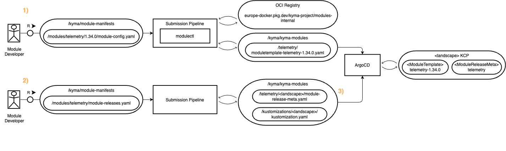

# Module Migration Guideline

This guide provides detailed instructions for how to migrate a Kyma module from existing (old) module metadata, especially channel-based ModuleTemplates, to the new module metadata, i.e. version-based ModuleTemplates accompanied by ModuleReleaseMeta.

It is highly recommended that module teams familiarize themselves again with the new module metadata before starting the migration. The ADR backing the migration is [#984](https://github.com/kyma-project/community/issues/984). An [Update on Module Metadata](https://sap-my.sharepoint.com/:p:/p/c_schwaegerl/EbvSNmRnr3JEjaLoZ__cI9UB9lu5tt0qaly-f7yQO2Gwbw?e=EZuruF) has also been given in the 2024-11-26 Iteration Review.

## Current Process

TODO: describe current process

## Target Process

The target process is shown in the figure below. As an example, the `telemetry` module is used. The promotion of module versions and their assignments to channels is managed via three individual processes. In addition, there is a fourth process to delete a module version.



### 1) Submitting a new module version

First, the module developer submits a new module version via a PR to the `/kyma/module-manifests` repository. The submission must provide a `module-config.yaml` file under the path `/modules/<module-name>/<module-version>` where `<module-version>` matches the version of the module configured in `module-config.yaml`. For the detailed format of the `module-config.yaml`, see below.

Once the PR is opened, the submission pipeline verifies that the info is correct. E.g., it verifies that the provided `module-config.yaml` is valid (e.g., it verifies that the FQDN of the module doesn't change), it builds the module via `modulectl` in `--dry-run` mode, and it verifies that the version does not exist yet.

Once the PR is merged, the submission pipeline builds and publishes the module via `modulectl` and pushes the generated ModuleTemplate to the `/kyma/kyma-modules` repository. The path of the generated ModuleTemplate is `/<module-name>/moduletemplate-<module-name>-<module-version>.yaml`.

For more details, see [New submission pipeline](https://github.tools.sap/kyma/test-infra/blob/feature/new-submission-pipeline/ado/new-submission-pipeline-activity.md).

> Note that this process only builds the necessary artifacts and puts them into their repositories, i.e. the OCI Registry and the `/kyma/kyma-modules` repository. The ModuleTemplate is NOT directly deployed into the KCP landscape.

### 2) Submitting a channel mapping

Second, the module developer submits a channel mapping via a PR to the `/kyma/module-manifests` repository. The submission must update the `module-releases.yaml` file under the path `/modules/<module-name>`. The `module-releases.yaml` is a simple mapping file to define what version each channel should map to. For the detailed format of the `module-releases.yaml`, see below.

Once the PR is opened, the submission pipeline verifies that the mapping is correct. E.g., it verifies that no version downgrade is performed for a channel and it verifies that the referenced module version exists.

Once the PR is merged, the submission pipeline generates the resulting ModuleReleaseMeta and kustomization and pushes them to the `/kyma/kyma-modules` repository. The kustomization includes the required ModuleTemplates and the ModuleReleaseMeta.

For more details, see [New submission pipeline](https://github.tools.sap/kyma/test-infra/blob/feature/new-submission-pipeline/ado/new-submission-pipeline-activity.md).

> Note that the ModuleReleaseMeta and kustomization are generated landscape specific. I.e., there is a separate ModuleReleaseMeta and kustomization per landscape. Reason behind this is that the `dev` channel is only allowed in `dev` landscape, and `experimental` channel is only allowed in `dev` and `stage` landscapes.

> Note that the kustomization is extended with ModuleTemplates for the versions referenced in the `module-releases.yaml` only. ModuleTemplates for versions not referenced are NOT added. Also, versions are not automatically removed from the kustomization, even if not referenced anymore. This needs to be done manually, see step 4).

> Note that this process and the previous one cannot be combined in one PR. First, the new module version must be submitted via 1), only then the channel mapping can be updated via 2).

### 3) Promoting ModuleTemplates and ModuleReleaseMeta

As noted above, the creation of a new ModuleTemplate does not automatically promote it to the landscapes. Instead, the `module-releases.yaml` file must be changed so that the kustomizations and ModuleReleaseMeta are updated.

Once those are updated by the submission pipeline, ArgoCD picks these changes up and deploys the ModuleTemplates and ModuleReleaseMetas relevant for the respective landscape.

TODO: verify with SRE that ArgoCD is ready to pick up the new kustomizations. Especially, in the NEW approach the DEV channel is automatically promoted to DEV landscape. Verify if this is okay.

### 4) Deleting a module version

To delete a unused module version, a PR to the `/kyma/module-manifests` repository is opened deleting the module versions' `module-config.yaml` file under `/modules/<module-name>/<module-version>`.

Once the PR is opened, the submission pipeline checks if the version is still in use by one or more channels. If so, the PR can't be merged.

Once the PR is merged, the submission pipeline deletes the related ModuleTemplate `/<module-name>/moduletemplate-<module-name>-<module-version>.yaml` in the `/kyma/kyma-modules` repository. In addition, it removes the reference to the module from the kustomization (*).

ArgoCD picks these changes to `/kyma/kyma-modules` up and undeploys the ModuleTemplate from the landscapes.

## Migration Path

To support seamless migration to the new module metadata, KLM and the submission pipeline support both, old and new module metadata at the same time. KLM first checks for the new module metadata, i.e. ModuleReleaseMeta and version-based ModuleTemplates, and reconciles the module based on this data if found. If the new module metadata is not found, KLM falls back to the old module metadata, i.e. channel-based ModuleTemplates.

To migrate a module to the new module metadata, the following steps need to be performed. The goal is to first replicate the existing setup with the NEW metadata, prepare a version update in the OLD metadata as a fallback, perform a version update using the NEW metadata, fallback to the OLD metadata in case of failures.

### 1) Submit the Existing Versions with the NEW Approach

First, the module developer re-submits the existing module versions via the new approach. As an example, assume the current module versions are:

- `telemetry-regular` pointing to `1.32.0`
- `telemetry-fast` pointing to `1.34.0`
- `telemetry-experimental` pointing to `1.34.0-experimental`
- `telemetry-dev` pointing to `1.35.0-rc1`

The developer needs to re-submit all versions above via the NEW approach. I.e., they need to submit:

- `/modules/telemetry/1.32.0/module-config.yaml`
- `/modules/telemetry/1.34.0/module-config.yaml`
- `/modules/telemetry/1.34.0-experimental/module-config.yaml`
- `/modules/telemetry/1.35.0-rc1/module-config.yaml`

For necessary changes in the `module-config.yaml` file, see [Migrating from Kyma CLI to `modulectl`](https://github.com/kyma-project/modulectl/blob/main/docs/contributor/migration-guide.md).

TODO: update the Migration from Kyma CLI to `modulectl` doc. Split it into the modulectl part and updated config part for easier consumption. For readers here, only the updated config part should be relevant.

Once the versions have been submitted, there are the following ModuleTemplates in `/kyma/kyma-modules`:

- `/telemetry/moduletemplate-telemetry-1.32.0.yaml`
- `/telemetry/moduletemplate-telemetry-1.34.0.yaml`
- `/telemetry/moduletemplate-telemetry-1.34.0-experimental.yaml`
- `/telemetry/moduletemplate-telemetry-1.35.0-rc1.yaml`

### 2) Submit the Existing Channel Mapping with the NEW Approach

Second, the module developer submits the channel-version mapping.

Following the example above, the following `modules/telemetry/module-releases.yaml` file is submitted:

```yaml
channels:
  - channel: regular
    version: 1.32.0
  - channel: fast
    version: 1.34.0
  - channel: experimental
    version: 1.34.0-experimental
  - channel: dev
    version: 1.35.0-rc1
```

Once the mapping has been submitted, there are the following resources in `/kyma/kyma-modules`:

- `/telemetry`
  - `/moduletemplate-telemetry-1.32.0.yaml`
  - `/moduletemplate-telemetry-1.34.0.yaml`
  - `/moduletemplate-telemetry-1.34.0-experimental.yaml`
  - `/moduletemplate-telemetry-1.35.0-rc1.yaml`
  - `/dev`
    - `module-release-meta.yaml` with
      - channel `regular` => `1.32.0`
      - channel `fast` => `1.34.0`
      - channel `experimental` => `1.34.0-experimental`
      - channel `dev` => `1.35.0-rc1`
  - `/stage`
    - `module-release-meta.yaml` with
      - channel `regular` => `1.32.0`
      - channel `fast` => `1.34.0`
      - channel `experimental` => `1.34.0-experimental`
  - `/prod`
    - `module-release-meta.yaml` with
      - channel `regular` => `1.32.0`
      - channel `fast` => `1.34.0`
- `/kustomizations`
  - `/dev`
    - `/kustomization.yaml` with
      - ModuleReleaseMeta `../../telemetry/dev/module-release-meta.yaml`
      - ModuleTemplate `../../telemetry/moduletemplate-telemetry-1.32.0.yaml`
      - ModuleTemplate `../../telemetry/moduletemplate-telemetry-1.34.0.yaml`
      - ModuleTemplate `../../telemetry/moduletemplate-telemetry-1.34.0-experimental.yaml`
      - ModuleTemplate `../../telemetry/moduletemplate-telemetry-1.35.0-rc1.yaml`
      - ... (resources from other modules)
  - `/stage`
    - `/kustomization.yaml` with
      - ModuleReleaseMeta `../../telemetry/stage/module-release-meta.yaml`
      - ModuleTemplate `../../telemetry/moduletemplate-telemetry-1.32.0.yaml`
      - ModuleTemplate `../../telemetry/moduletemplate-telemetry-1.34.0.yaml`
      - ModuleTemplate `../../telemetry/moduletemplate-telemetry-1.34.0-experimental.yaml`
      - ... (resources from other modules)
  - `/prod`
    - `/kustomization.yaml` with
      - ModuleReleaseMeta `../../telemetry/stage/module-release-meta.yaml`
      - ModuleTemplate `../../telemetry/moduletemplate-telemetry-1.32.0.yaml`
      - ModuleTemplate `../../telemetry/moduletemplate-telemetry-1.34.0.yaml`
      - ... (resources from other modules)

### 3) Verify the New Module Metadata in KCP

ArgoCD pickes up and deploys the changes from step 2). All landscapes have the same channel-version mapping of the module described in OLD and NEW metadata.

Following the example above, the following resources exist in KCP:

- ModuleTemplate `kyma-system/telemetry-regular` pointing to `1.32.0`
- ModuleTemplate `kyma-system/telemetry-fast` pointing to `1.34.0`
- ModuleTemplate `kyma-system/telemetry-experimental` pointing to `1.34.0-experimental` (only in DEV and STAGE)
- ModuleTemplate `kyma-system/telemetry-dev` pointing to `1.35.0-rc1` (only in DEV)
- ModuleReleaseMeta `kyma-system/telemetry`
- ModuleTemplate `kyma-system/telemetry-1.32.0`
- ModuleTemplate `kyma-system/telemetry-1.34.0`
- ModuleTemplate `kyma-system/telemetry-1.34.0-experimental` (only in DEV and STAGE)
- ModuleTemplate `kyma-system/telemetry-1.35.0-rc1` (only in DEV)

As the new module metadata takes precedence, the reconciliation of the module already happens based on the new metadata. Since all versions and channel mappings are the same, no update is performed and all modules stay in the same state as before.

The functionality can further be verified by enabling the module in a test SKR which will install it from scratch using the new metadata.

### 4) [FAILURE] Rollback the New Module Metdata

In case a failure happens, the setup can be reverted to the old approach.

To do so, a PR can be opened to `/kyma/kyma-modules` reverting the submission from 2). ArgoCD then undeploys the new module metdata and KLM falls back to the old module metadata.

> Note that after rollback, the old submission pipeline can still be used to submit new versions of the module while working on a fix.

TODO: verify with neighbors if this can be done easily.

### 5) Submit a Version Upgrade with the OLD Approach

As a next migration step, a version upgrade of the module is rolled out. To prepare for failure, the same update is first prepared using the OLD metadata.

Staying with the example above, the module developer submits a new version for the `regular` channel via the OLD approach. I.e., they submit:

- `/modules/telemetry/regular/module-config.yaml` pointing to `1.34.0` (before `1.32.0`)

Once this update is submitted, ArgoCD will deploy the ModuleTemplate `kyma-system/telemetry-regular` with the updated version to KCP. However, since there is new module metadata available in KCP, KLM continues to use the new metadata and ignores this ModuleTemplate and therefore the new version.

> Note that the reason for still submitting this old metadata is to be able to easly rollback to the old metadata in case the update with the new metadata fails. If the old metadata would be on a version lower than the new metadata, this could lead to additional errors when reverting as KLM doesn't support version downgrades.

### 6) Submit the Updated Channel Mapping with the NEW Approach

After preparing the old metadata to rollback in case of failure, the actual version update using the new metadata can be performed.

Following the example, the module developer submits the following `modules/telemetry/module-releases.yaml` file:

```yaml
channels:
  - channel: regular
    version: 1.34.0 # <= this version is bumped
  - channel: fast
    version: 1.34.0
  - channel: experimental
    version: 1.34.0-experimental
  - channel: dev
    version: 1.35.0-rc1
```

Once the mapping has been submitted, the resources in `/kyma/kyma-modules` equal the ones from step 2), except the `regular` channel pointing to version `1.34.0` in all ModuleReleaseMetas for different landscapes.

### 7) Verify the Module is Updated in KCP

ArgoCD picks up this change and deploys the new ModuleReleaseMeta to the different landscapes. KLM is now picking up the version change and updates all modules using the `regular` channel to version `1.34.0`.

### 8) [FAILURE] Rollback new Module Metadata

In case a failure happens, the setup can be reverted to the old approach.

To do so, a PR can be opened to `/kyma/kyma-modules` reverting the submissions from 2) and 6). It is important to revert completely removing the entire new metadata from KCP so that KLM falls back to the old module metadata.

> Note that after rollback, the old submission pipeline can still be used to submit new versions of the module while working on a fix.

TODO: verify with neighbors if this can be done easily.

### 9) Remove the OLD Metadata

Once it has been verified that the module works with the new metadata, the old metadata is deleted.

TODO: verify how this is done. Can we just delete the channels from `/kyma/module-manifests` and the submission pipeline deletes the images and ModuleTemplates. ArgoCD then removes them from KCP?

### 10) Continue Module Lifecycle with the NEW Approach

Continue to use the new approach to provide new module versions and update the mapping of channels.
