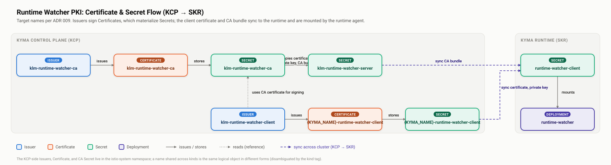

# ADR 009 - Consistent Runtime Watcher Terminology

## Status

Accepted

## Context

The naming applied to the Watcher mechanism and its Public Key Infrastructure (PKI) is inconsistent across code, configuration, and documentation. The same concept often carries a different name in each layer, and some names contradict what they describe.

The following examples illustrate the problem:

- The mechanism is called `runtime watcher` in official material, `Watcher` in the custom resource and controller, and `SkrWebhook` in the deployed artifact.
- The certificate hierarchy is described as server certificate and client certificate in [ADR 007](007-pki-certs-and-rotation.md), as `root`, `serving`, and `selfsigned` in configuration, and as `SkrCertificate` in code.
- The Issuer named `klm-watcher-selfsigned` is a Certificate Authority (CA) Issuer that signs client certificates. It is not self-signed, so the name contradicts its function.
- The command-line flags use the `--self-signed-cert-*` prefix for certificates that follow the server and client roles defined in ADR 007.

A reader who moves between the code, the manifests, and the documentation must repeatedly re-map one concept onto several names. This slows down onboarding, makes incident response harder, and hides the actual structure of the PKI.

This ADR defines one vocabulary for the mechanism and its PKI, and records the target name for every part in every layer. It extends the naming guidelines of [ADR 005](005-consistent-naming.md) and reuses the certificate vocabulary of [ADR 007](007-pki-certs-and-rotation.md).

## Decision

Names describe function in the solution domain. A name states what a thing is and what role it plays, not where it happens to sit or how it was bootstrapped. The same concept uses the same name in code, configuration, and documentation.

### Canonical Terms

The following canonical terms apply to the mechanism and its parts:

| Concept | Canonical Term | Definition |
|---------|----------------|------------|
| The mechanism and its deployed agent | Runtime Watcher | The mechanism as a whole: the KCP-side custom resource and controller, the Istio routing KLM configures, and the agent component from the `runtime-watcher` repository that KLM deploys into the runtime. One term covers both sides. |
| The self-signed CA certificate | CA certificate | The self-signed certificate that anchors the Runtime Watcher PKI. It also serves as the server certificate. See ADR 007. |
| The certificate the gateway presents | Server certificate | The certificate the Runtime Watcher Istio gateway presents to the runtime. Equal to the CA certificate. See ADR 007. |
| The per-runtime certificate | Client certificate | The certificate the runtime agent presents to the gateway. Signed by the CA certificate. One per runtime. See ADR 007. |

Two rules resolve the central ambiguities:

- **Runtime Watcher names the mechanism uniformly.** The same term applies to the KCP-side custom resource and controller and to the agent deployed into the runtime. Previously, `Watcher` named the KCP side and `Runtime Watcher` named the runtime agent, which required readers to maintain a mapping. The custom resource is renamed from `Watcher` to `RuntimeWatcher` as part of this ADR.
- **The PKI uses the ADR 007 vocabulary.** The mechanism uses a self-signed CA certificate that doubles as the server certificate, and per-runtime client certificates signed by that CA. The terms root, leaf, and self-signed are not used for these certificates, because they either lose the server-and-client role distinction or contradict the actual function.

### Naming Scheme

The scheme renames every part that does not already follow the canonical terms. It applies to Kubernetes resources, Secrets, command-line flags, Go identifiers, and documentation, so that one concept reads the same everywhere.

#### Kubernetes Resources and Secrets

All Kubernetes resources KLM manages on the KCP carry a `klm-` prefix. The KCP hosts other components beside KLM, so the prefix identifies KLM ownership and prevents name collisions in shared namespaces such as `istio-system`. The prefix is applied globally by the `namePrefix: klm-` directive in `config/control-plane/kustomization.yaml`; Secrets that cert-manager creates outside kustomize's control carry it explicitly in their `secretName` field.

##### KCP-Side Resources

| Current Name | Kind        | Target Name                          | Rationale                                                                                |
|--------------|-------------|--------------------------------------|------------------------------------------------------------------------------------------|
| `Watcher` | CustomResourceDefinition | `RuntimeWatcher`              | The mechanism is Runtime Watcher uniformly; the CRD and its instances are renamed accordingly. |
| `klm-watcher-root` | Issuer      | `klm-runtime-watcher-ca`             | It is the self-signed Issuer that bootstraps the CA certificate.                         |
| `klm-watcher-serving` | Certificate | `klm-runtime-watcher-ca`             | It is the CA certificate, which also serves as the server certificate.                   |
| `klm-watcher` | Secret      | `klm-runtime-watcher-ca`             | Stores the CA certificate. Matches the Certificate name.                                 |
| `klm-istio-gateway` | Secret      | `klm-runtime-watcher-server`         | Stores the server certificate and the CA bundle used by the gateway.                     |
| `klm-watcher-selfsigned` | Issuer      | `klm-runtime-watcher-client`         | It is the CA Issuer that signs client certificates. It is not self-signed.               |
| `klm-{KYMA_NAME}-webhook-tls` | Certificate | `klm-{KYMA_NAME}-runtime-watcher-client` | Requests a client certificate on KCP, one per runtime.                               |
| `klm-{KYMA_NAME}-webhook-tls` | Secret      | `klm-{KYMA_NAME}-runtime-watcher-client` | Stores a client certificate on KCP, one per runtime. Matches the Certificate name.   |
| `klm-watcher` | Gateway     | `klm-runtime-watcher`                | The Istio Gateway that terminates mTLS connections from runtimes. Defined in `config/watcher/gateway.yaml`; the `klm-` prefix is applied by kustomize. |
| `{WATCHER_CR_NAME}` | VirtualService | `{RUNTIME_WATCHER_CR_NAME}`    | One VirtualService per RuntimeWatcher CR; name follows the CR name. Renamed as part of the CRD rename. |
| `operator.kyma-project.io/watcher-gateway` | Label | `operator.kyma-project.io/runtime-watcher-gateway` | Label selector used to discover the Gateway. |

##### Runtime-Side Resources

The runtime-side resources are defined in `skr-webhook/resources.yaml`. The `skr-webhook` prefix becomes `runtime-watcher` throughout.

| Current Name | Kind        | Target Name                                          | Rationale                                                                    |
|--------------|-------------|------------------------------------------------------|------------------------------------------------------------------------------|
| `skr-webhook-tls` | Secret      | `runtime-watcher-client`                      | The client certificate and CA bundle synced to the runtime.                  |
| `skr-webhook` | Deployment  | `runtime-watcher`                              | The Runtime Watcher deployment in the runtime.                               |
| `skr-webhook` | Service     | `runtime-watcher`                              | The Service fronting the Runtime Watcher deployment.                         |
| `skr-webhook-metrics` | Service | `runtime-watcher-metrics`                   | The metrics-scraping Service for the Runtime Watcher.                        |
| `skr-webhook-priority` | PriorityClass | `runtime-watcher-priority`             | The PriorityClass reserved for the Runtime Watcher pod.                      |
| `kyma-project.io--seed-to-watcher` | NetworkPolicy | `kyma-project.io--seed-to-runtime-watcher` | Controls ingress from the VPN shoot to the Runtime Watcher. |
| `kyma-project.io--watcher-to-apiserver` | NetworkPolicy | `kyma-project.io--runtime-watcher-to-apiserver` | Controls egress from the Runtime Watcher to the API server. |
| `kyma-project.io--metrics-to-watcher` | NetworkPolicy | `kyma-project.io--metrics-to-runtime-watcher` | Controls ingress to the Runtime Watcher metrics port. |
| `kyma-project.io--watcher-to-dns` | NetworkPolicy | `kyma-project.io--runtime-watcher-to-dns` | Controls egress from the Runtime Watcher to DNS resolvers. |

The following diagram shows the KCP-side Issuers, Certificates, and Secrets under their target names, and how the certificates flow from KCP to the runtime:

#### Command-Line Flags

The `--self-signed-cert-*` flags are renamed to `--runtime-watcher-client-cert-*`, because they configure the per-runtime client certificate, not the CA certificate. The `--self-signed-cert-issuer-*` flags name the Issuer that signs those client certificates, so they follow the same `client-cert` prefix. The `--skr-watcher-*`, `--skr-webhook-*`, and `--istio-gateway-*` flags are renamed to `--runtime-watcher-*`.

| Current Flag | Target Flag |
|--------------|-------------|
| `--self-signed-cert-duration` | `--runtime-watcher-client-cert-duration` |
| `--self-signed-cert-renew-before` | `--runtime-watcher-client-cert-renew-before` |
| `--self-signed-cert-renew-buffer` | `--runtime-watcher-client-cert-renew-buffer` |
| `--self-signed-cert-key-size` | `--runtime-watcher-client-cert-key-size` |
| `--self-signed-cert-issuer-name` | `--runtime-watcher-client-cert-issuer-name` |
| `--self-signed-cert-issuer-namespace` | `--runtime-watcher-client-cert-issuer-namespace` |
| `--istio-gateway-name` | `--runtime-watcher-gateway-name` |
| `--istio-gateway-namespace` | `--runtime-watcher-gateway-namespace` |
| `--istio-gateway-cert-switch-before-expiration-time` | `--runtime-watcher-server-cert-switch-before-expiration-time` |
| `--istio-gateway-server-cert-switch-grace-period` | `--runtime-watcher-server-cert-switch-grace-period` |
| `--istio-gateway-server-cert-expiry-window` | `--runtime-watcher-server-cert-expiry-window` |
| `--istio-gateway-secret-requeue-success-interval` | `--runtime-watcher-server-cert-requeue-success-interval` |
| `--istio-gateway-secret-requeue-error-interval` | `--runtime-watcher-server-cert-requeue-error-interval` |
| `--watcher-requeue-success-interval` | `--runtime-watcher-requeue-success-interval` |
| `--skr-watcher-image-name` | `--runtime-watcher-image-name` |
| `--skr-watcher-image-tag` | `--runtime-watcher-image-tag` |
| `--skr-watcher-image-registry` | `--runtime-watcher-image-registry` |
| `--skr-webhook-memory-limits` | `--runtime-watcher-memory-limits` |
| `--skr-webhook-cpu-limits` | `--runtime-watcher-cpu-limits` |

The duration, renewal, and key size of the CA certificate are not configured by any flag. They are set on the CA Certificate resource in `config/[certmanager|gardener-certmanager]/certificate_watcher.yaml`.

#### Go Identifiers

##### Exported Identifiers

| Concept | Current | Target |
|---------|---------|--------|
| The watcher package | `internal/watcher` | `internal/runtimewatcher/client` |
| The watcher resource service type | `SkrWebhookManifestManager` | `runtimewatcher/client.Service` |
| The certificate service interface | `SKRCertificateService` | `ClientCertificateService` |
| Create the client certificate | `CreateSkrCertificate` | `CreateClientCertificate` |
| Renew the client certificate | `RenewSkrCertificate` | `RenewClientCertificate` |
| Delete the client certificate | `DeleteSkrCertificate` | `DeleteClientCertificate` |
| Check renewal is overdue | `IsSkrCertificateRenewalOverdue` | `IsClientCertificateRenewalOverdue` |
| Get the client certificate secret | `GetSkrCertificateSecret` | `GetClientCertificateSecret` |
| The client certificate name helper | `name.SkrCertificate` | `name.ClientCertificate` |
| The CA bundle timestamp accessor | `getGatewaySecretCaBundleExtendedAtTime` | `getCaAddedToBundleAtTime` |
| The client cert flag fields | `SelfSignedCert*` | `RuntimeWatcherClientCert*` |
| The server certificate controller package | `internal/controller/istiogatewaysecret` | `internal/runtimewatcher/server` |
| The server certificate service package | `internal/gatewaysecret` | `internal/runtimewatcher/server` |
| The server certificate controller name | `"istio-controller"` | `"runtime-watcher-server-certificate-controller"` |
| The server certificate handler method | `Handler.ManageGatewaySecret` | `Handler.ManageServerCertificate` |
| The server certificate rotation client | `GatewaySecretRotationClient` | `RotationClient` |
| The server certificate constructor | `NewGatewaySecretHandler` | `NewHandler` |
| The server certificate metrics interface | `GatewaySecretMetrics` | `Metrics` |
| The server certificate metrics type | `metrics.GatewaySecret` | `metrics.ServerCertificate` |
| The server certificate metrics constructor | `metrics.NewGatewaySecret` | `metrics.NewServerCertificate` |
| The server certificate flag fields | `IstioGatewayServerCert*` / `IstioGatewaySecret*` | `RuntimeWatcherServerCert*` |

The `SkrWebhookManifestManager` type installs and removes the Runtime Watcher resources on the runtime and orchestrates the client certificate lifecycle. It lives in package `watcher` and is a service in the sense of ADR 005, so it becomes `runtimewatcher/client.Service` after the package is renamed. The `Manager` suffix and the `Watcher` prefix are both dropped: ADR 005 sanctions the `Service` suffix and establishes context from the package name, so a `RuntimeWatcher` prefix would stutter. The `Reconciler` suffix is reserved for controller-runtime reconcilers, which this type is not.

The variable spellings for the `caAddedToBundleAt` annotation converge on one form. The annotation is `caAddedToBundleAt`. Code currently reads it through variables named `caBundleExtendedAt`, `caBundledAt`, and `getGatewaySecretCaBundleExtendedAtTime`. The target uses `caAddedToBundleAt` consistently.

##### Private Identifiers (Non-Exhaustive)

The following private identifiers carry outdated terminology and are renamed alongside the exported ones. This list covers the most important cases; parameter names using `rootSecret` are renamed to `caSecret` at the same call sites.

| Current | Target | Location |
|---------|--------|----------|
| `createGatewaySecretFromRootSecret` | `createServerSecretFromCASecret` | `runtimewatcher/server` |
| `requiresCertSwitching` | `requiresServerCertSwitching` | `runtimewatcher/server` |
| `getCaBundledAt` | `getCaAddedToBundleAtTime` | `runtimewatcher/server` |
| `isRootSecret` | `isCASecret` | `runtimewatcher/server` |
| `kcpRootSecretName` / `getRootSecret` | `kcpCASecretName` / `getCASecret` | `runtimewatcher/server` |

#### Documentation

Documentation uses the canonical terms. Kubernetes resource names in component tables and reference material are updated to the target names. Existing documents are updated as they are touched.

### Migration

Go identifiers and documentation carry no external contract and are renamed directly. The following entities are operational contracts — live landscapes reference them — and require a staged migration:

- **`Watcher` CRD and existing CR instances** — renamed to `RuntimeWatcher`; existing instances must be migrated in place or replaced.
- **cert-manager and GCM resources in KCP** — the CA Issuer, CA Certificate, CA Secret, server Secret, client Issuer, and per-runtime client Certificate and Secret (see KCP-side resources table).
- **Istio Gateway and label selector** — `klm-watcher` Gateway and the `operator.kyma-project.io/watcher-gateway` label.
- **Runtime-side resources in the Kyma runtime** — Deployment, Services, PriorityClass, and NetworkPolicies (see the runtime-side resources table).
- **CLI flags** — all `--self-signed-cert-*`, `--istio-gateway-*`, `--skr-watcher-*`, `--skr-webhook-*`, and `--watcher-requeue-*` flags (see flags table above).

Each renamed contract follows a three-step transition: introduce the new name alongside the old one, migrate producers and consumers, then remove the old name once no landscape references it. CLI flags keep the old form as a deprecated alias for one release before removal.

## Consequences

- The project has one agreed vocabulary for the Runtime Watcher mechanism and its PKI, aligned with ADR 007. One concept reads the same in code, configuration, and documentation.
- Names describe function, so the misleading `selfsigned` Issuer name and the split `Watcher`/`Runtime Watcher` terminology are resolved rather than documented around.
- Renaming operational contracts (Kubernetes resources, Secrets, flags, the CRD itself) requires a staged migration per landscape. The effort is one-time and is scoped as follow-up work.
- Until the migration completes, some names still use the old form. The target names recorded here bound that transitional state and serve as the reference for the follow-up implementation.
