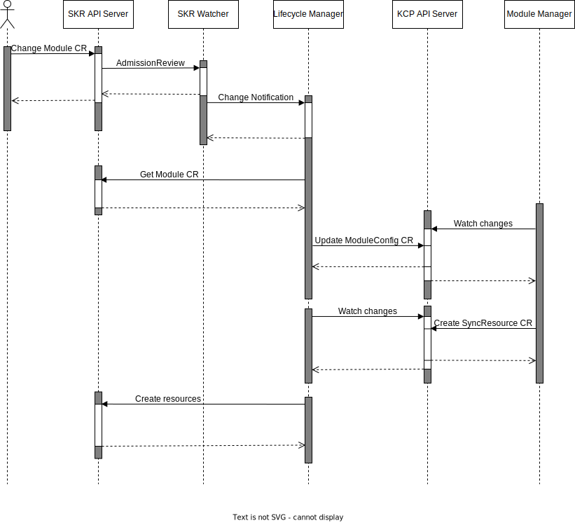

# ModuleConfig Custom Resource

The [ModuleConfig custom resource (CR)](../../../api/v1alpha1/moduleconfig_types.go) facilitates the synchronization of `Module` CR configuration between the SKR and KCP clusters, reflecting dynamic changes made by the user.

## Generation

The SKR Watcher notifies the Lifecycle Manager (LM) in case of changes detected in a `Module`. A `ModuleConfig` is then generated/updated by the LM in from the `Module` within the SKR cluster.

## Preconditions

For a `ModuleConfig` to be generated, the following preconditions must be met:
- The SKR Watcher must be enabled.
- The `.spec.enableModuleConfig` field in the `ModuleTemplate` must be true. Use the `--enableModuleConfig` CLI flag when generating `ModuleTemplate` to set this field.

## Workflow

The workflow for the `ModuleConfig` involves several steps, orchestrated primarily by the LM and the SKR Watcher:

1. An existing `Module` CR within the SKR is updated by the end-user.

2. The SKR Watcher gets triggered.

3. The SKR Watcher notifies the LM about a change in the `Module` CR.

4. The LM fetches the latest version of `Module` CR from the SKR cluster.

5. Subsequently, the LM generates or updates the `ModuleConfig` from the `Module` within the SKR cluster.

6. This `ModuleConfig` CR is being watched by the respective Module Manager (MM) for changes.

7. The MM will generate a `SyncResource` CR from the `ModuleConfig`, enabling the LM to reconcile the user's changes.




## Configuration
### **.spec.kyma** and **.spec.module**
These are mandatory fields specifying the names of the target `Kyma` and `Module` on the SKR from which this `ModuleConfig` originates.

The following `ModuleConfig` belongs to the `sample-yaml` module related to the `kyma-sample-dzeas` kyma:
```yaml
apiVersion: operator.kyma-project.io/v1alpha1
kind: ModuleConfig
metadata:
  labels:
    "operator.kyma-project.io/kyma-name": kyma-sample-dzeas
    "operator.kyma-project.io/module-name": sample-yaml
  name: moduleconfig-sample
  namespace: kcp-system
spec:
  kyma: kyma-sample-dzeas
  module: sample-yaml
```

### .spec.resource

This field contains the `Module` CR YAML content as plain text, including the subresource (status) field.
It reflects the configuration done by the user and used by the MM to generate the corresponding `SyncResource` CR.

E.g., The following `ModuleConfig` syncs the sizes of NFS volumes configured by the user is the SKR:
```yaml
spec:
  resource: |
      apiVersion: operator.kyma-project.io/v1alpha1
      kind: Infrastructure
      metadata:
        name: default
        namespace: kyma-system
      spec:
        vpcPeerings:
          - name: peering-1
            description: peering-1
            remoteVpcId: vpc-1
            remoteRegion: eu-central-1
            remoteCidrRange:
          - name: peering-2
            description: peering-2
            remoteVpcId: vpc-2
            remoteRegion: eu-central-1
            remoteCidrRange:
        nfsVolumes:
          - name: nfs-1
            description: nfs-1
            size: 100Gi
          - name: nfs-2
            description: nfs-2
            size: 100Gi
       status:
          ...
          state: Ready
```

### `operator.kyma-project.io` labels:

These are the labels available on the `ModuleConfig` CR:
- `operator.kyma-project.io/kyma-name`: string. It enables the Module manager to identify the target Kyma runtime where this config coming from.
- `operator.kyma-project.io/module-name`: string. It provides the individal Module manager to filter the ModuleConfig which belongs to it.
